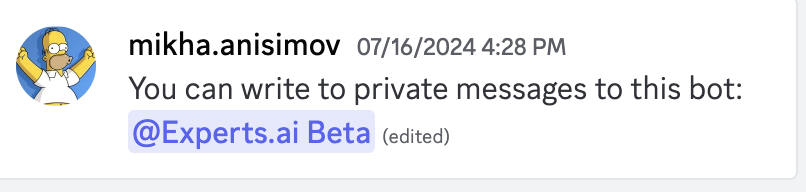

# User Guide for Edumatch Bot

## Usage

1. To join the server with the bot, use this [link](https://discord.com/invite/tkQCcq9z)
2. Once you are there, click on the pinned messages icon, in the top right corner, where there will be a link to the following message:
3. Then, click the link to the bot to start chatting with it.
4. You can use the command /start to begin.

## Features
**1. Natural Language Processing for Job Preferences:**

- You can write to the bot in natural language, explaining your skills, preferences, and experiences.

- Example: "I enjoy frontend development, I like JavaScript, especially React and Angular, also I had some experience in Django for the backend."

- The bot will understand this input and propose suitable job opportunities based on the provided information.

**2. CV Parsing and Summarization:**

- If you prefer not to type out your information, you can send your CV to the bot.

- The bot will parse the CV, extract the most relevant information, and summarize what it understood about your skills and experience.

**3. Direct Links to Job Descriptions and Applications:**

- The links provided by the bot lead to web pages with more detailed job descriptions.

- These pages also have the option to apply directly for the job.

**4. Language Filtering for Job Offers:**

- The bot can filter job offers to show only those available in English if that is your preference.